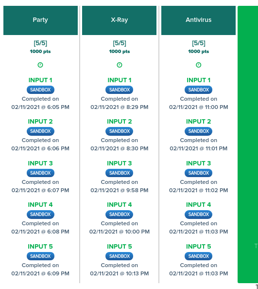
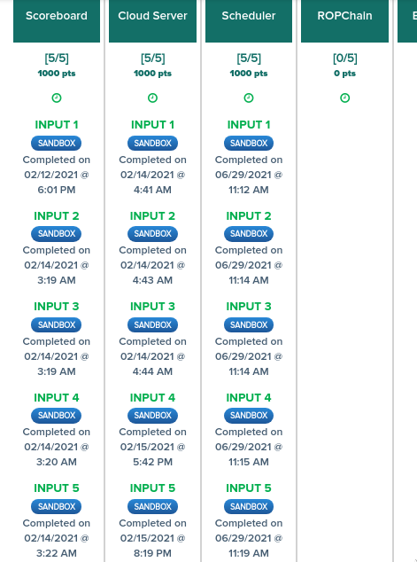

# Reply Competitive Programming Challenges 2020

> url = [https://challenges.reply.com/tamtamy/challenge/code-teen2020/detail](https://challenges.reply.com/tamtamy/challenge/code-teen2020/detail)

It was my first time into competitive programming :D\
I was willing to join this year's competition (2021), I did their proposed week-1 training challenges (2/3 were a piece of cake, the other was medium imo), and right next to them I tried the 2020 challenges and the competition passed while I'm still trying to solve the 3rd challenge lol.

It was reaaaaally good <33

## Files
- PDFs are challenges
- py files are my solutions

## Scoreboards, Timing
(sometimes continuously doing them, sometimes not)

### Training Week-1

### 2020 Competition
which happens to be the same thing given in Training Week-3, (the 3 first challenges).\
I cant continue with them now, I'm getting busier in more important stuff.\
for sure I'm continuing later in sha Allah <3\

